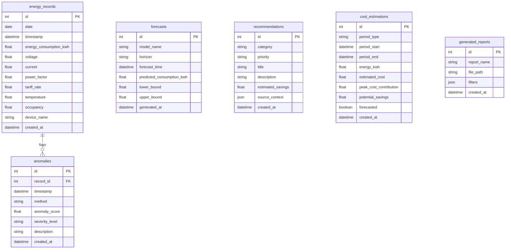

# ER Diagram

```mermaid
erDiagram
    energy_records ||--o{ anomalies : "flags"

    energy_records {
        int id PK
        date date
        datetime timestamp
        float energy_consumption_kwh
        float voltage
        float current
        float power_factor
        float tariff_rate
        float temperature
        float occupancy
        string device_name
        datetime created_at
    }

    forecasts {
        int id PK
        string model_name
        string horizon
        datetime forecast_time
        float predicted_consumption_kwh
        float lower_bound
        float upper_bound
        datetime generated_at
    }

    anomalies {
        int id PK
        int record_id FK
        datetime timestamp
        string method
        float anomaly_score
        string severity_level
        string description
        datetime created_at
    }

    recommendations {
        int id PK
        string category
        string priority
        string title
        string description
        float estimated_savings
        json source_context
        datetime created_at
    }

    cost_estimations {
        int id PK
        string period_type
        datetime period_start
        datetime period_end
        float energy_kwh
        float estimated_cost
        float peak_cost_contribution
        float potential_savings
        boolean forecasted
        datetime created_at
    }

    generated_reports {
        int id PK
        string report_name
        string file_path
        json filters
        datetime created_at
    }
```
